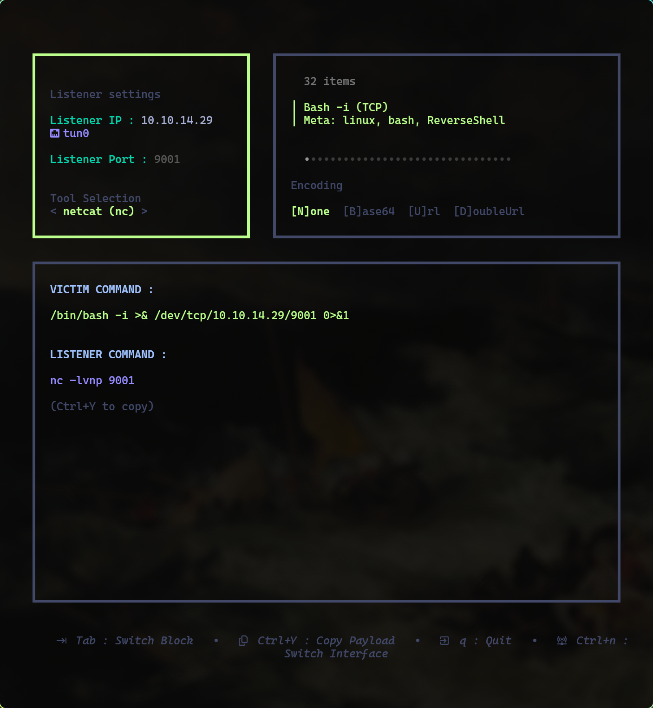

<div align="center"><h1>Ygloo</h1></div>

<div align="center">


Un générateur de reverse shells interactif en TUI ma foi charmant
</div>


## Fonctionnalités

- **Interface TUI moderne** - Navigation intuitive avec Bubble Tea
- **30+ reverse shells** - Bash, Python, PHP, PowerShell, Netcat, et plus
- **Détection automatique d'IP** - Switch entre interfaces réseau (Ctrl+N)
- **Encodage multiple** - None, Base64, URL, Double URL
- **Copie instantanée** - Ctrl+Y pour copier dans le presse-papiers
- **Bind shells inclus** - Python, Netcat, Perl
- **Configuration JSON** - Facile à étendre et personnaliser

## Installation

```bash
# Clone le repository
git clone https://github.com/yourusername/revshell-tui.git
cd revshell-tui

# Build
cd src
go build -o revshell-tui

# Lance l'application
./revshell-tui
```
## Démonstration




### Dépendances

- [Bubble Tea](https://github.com/charmbracelet/bubbletea) - Framework TUI
- [Bubbles](https://github.com/charmbracelet/bubbles) - Composants TUI
- [Lipgloss](https://github.com/charmbracelet/lipgloss) - Styling
- [clipboard](https://github.com/atotto/clipboard) - Gestion presse-papiers