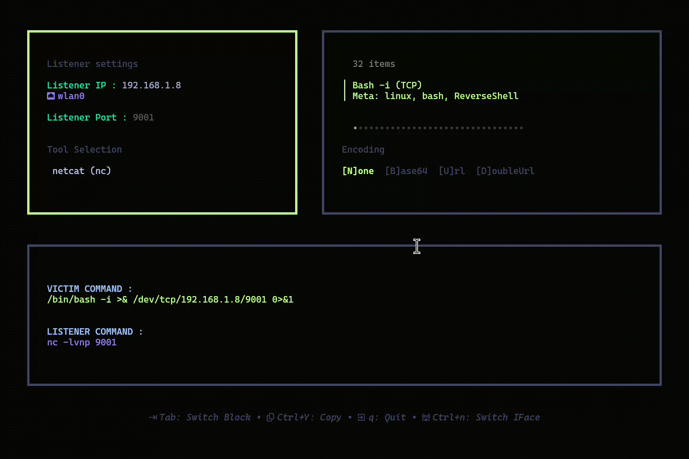

<div align="center">

# Ygloo


**Un générateur de reverse shells interactif en TUI, simple et élégant.**



</div>

## 🚀 Fonctionnalités

- **Interface TUI** moderne et intuitive (Bubble Tea)
- **30+ Reverse Shells** (Bash, Python, PHP, PowerShell, Netcat...)
- **Détection IP** automatique (Switch avec `Ctrl+N`)
- **Encodage** à la volée (Base64, URL, Double URL)
- **Zero Config** : Tout est inclus dans le binaire unique

## 📦 Installation

```bash
git clone https://github.com/ygp4ph/Ygloo
cd Ygloo
go build -o Ygloo
./Ygloo
```

## 🎮 Utilisation

- **Tab** : Changer de panneau
- **Fléches / hjkl** : Naviguer
- **Ctrl+n** : Changer d'interface réseau
- **Ctrl+y** : Copier la commande
- **q** : Quitter